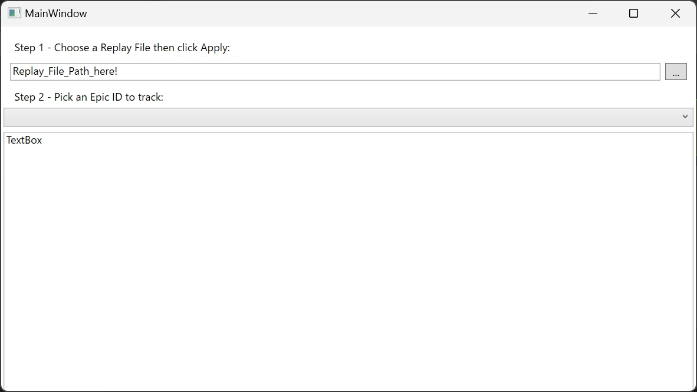
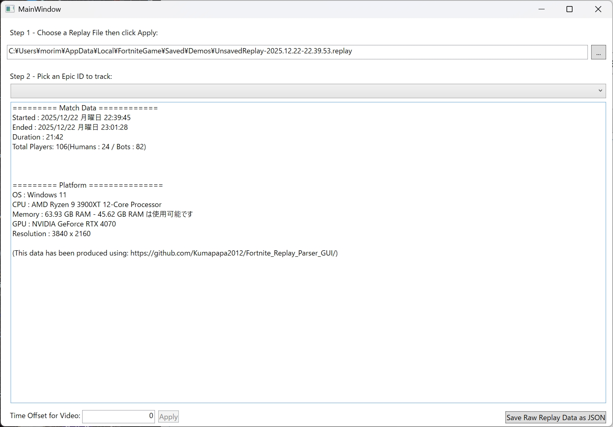
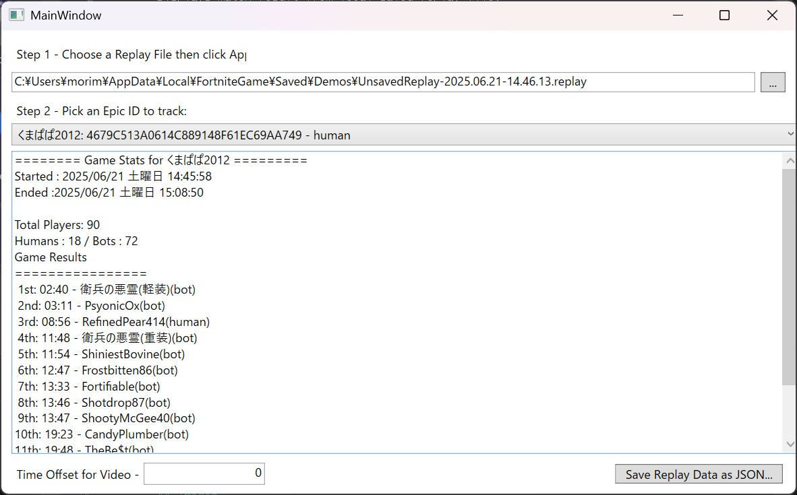

# Fortnite_Replay_Parser_GUI
Displays match result from local saved replay file.
Results include player's name, eliminations, match start and end time, and match result.

Timestamps in Result can be used for Youtube video description.
Please feel free to folk and customise this code.

## Building
Make sure you have .NET 9.0 SDK or later installed.

Download the source code and open it in Visual Studio 2022 or later and build the solution in Release mode to generate the executable file.

Or you can use the command line to start:
 
```
PS D:\> git clone git@github.com:Kumapapa2012/Fortnite_Replay_Parser_GUI.git
PS D:\Fortnite_Replay_Parser_GUI> cd Fortnite_Replay_Parser_GUI
PS D:\Fortnite_Replay_Parser_GUI> dotnet publish
PS D:\Fortnite_Replay_Parser_GUI> .\bin\Release\net9.0-windows\win-x64\publish\Fortnite_Replay_Parser_GUI.exe
```

## Usage
1. Click [...] and Pick a Replay File using File Dialog.
2. Select a player to get match data from the dropdown list.
3. Parsed Result will have:
   - Match start and end time
   - Player's name
   - Player's eliminations
   - Match result: Eliminated by X / Victory Royale.
4. Adjust offset to change the timing of termination events in seconds.
   - Accepts both positive/negative integer.
   - Useful for adjusting event timings on Video Recording. 
## Images






## License
GNU AFFERO GENERAL PUBLIC LICENSE

## Dependencies
This project was made with:
- FortniteReplayReader 
	- Inside  FortniteReplayDecompressor
	(https://fortnitereplaydecompressor.readthedocs.io/en/latest/?badge=latest)