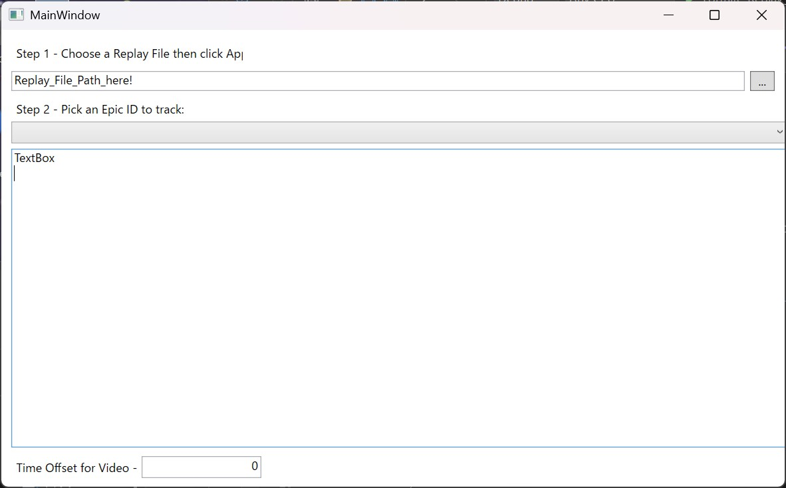

# Fortnite_Replay_Parser_GUI
Parses Fortnite replay file and displays match result.
Please feel free to folk and customise this code for your conveniences.

## Start
Download the .exe from bin folder and run.

## Usage
1.   Pick a Replay File using File Dialog.
2.   Select a player
3.   Parsed Result will be shown.
- The time match started / ended
- Eliminations of selected player
- Match result: Eliminated by X / Victory Royale.

## Images

